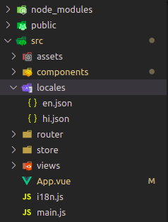
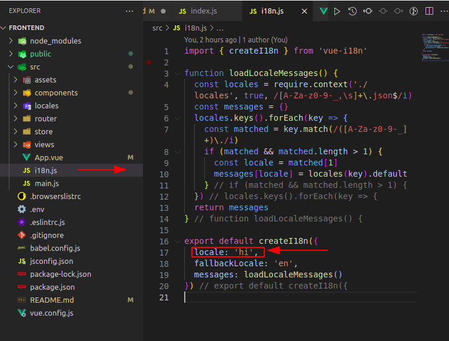

# Application - Kisaan

## Project setup
```
npm install
```

### Compiles and hot-reloads for development
```
npm run serve
```

### Compiles and minifies for production
```
npm run build
```

### Lints and fixes files
```
npm run lint
```

### Customize configuration
See [Configuration Reference](https://cli.vuejs.org/config/).

### Topics for study -

1. Routing - Vue Router
2. Dynamic routing
3. Route guard / middleware
4. Localization (languages)  - Vuei18n
5. API hanling - Axios
6. Form validation - VeeValidate
7. State management  - Vuex like redux for react

=============================== Add vuei18n ===============================
## Add Vuei18n in Vuejs projects steps:- 

### Install row project -

1. Go to Vuejs official [website](https://cli.vuejs.org/guide/creating-a-project.html), and create command using bellow command -
Syntax-

        vue create projectName

    Example - 

        vue create vuei18n

2. After run this command open options-

        Vue CLI v5.0.1
        ?   Please pick a preset: (Use arrow keys)
        ❯   Default ([Vue 3] babel, eslint) 
            Default ([Vue 2] babel, eslint) 
            Manually select features 

    Use Arrow key (UP and DOWN) and select Manually select features using enter key.after this select open new panel -

        Vue CLI v5.0.1
        ? Please pick a preset: Manually select features
        ? Check the features needed for your project: (Press <space> to select, <a> to toggle all, <i> to invert selection, and <enter> to proceed)
            ◉ Babel
            ◯ TypeScript
            ◯ Progressive Web App (PWA) Support
            ◉ Router
        ❯   ◉ Vuex
            ◯ CSS Pre-processors
            ◉ Linter / Formatter
            ◯ Unit Testing
            ◯ E2E Testing
    Use Arrow key (UP and DOWN) and select Router and Vuex using space button key.
3.  Chnage current directory using commad -

        cd projectName

4.  Open project in Vscode using command -

        code .

### Add vuei18n -
1. Go to official vuei18n [website](https://kazupon.github.io/vue-i18n/installation.html#direct-download-cdn)  copy vue add i18n command and run in terminal -

        vue add i18n

2. Add vuei18n in project using main.js file means import vuei18n in main.js file.

        import { createApp } from 'vue'
        import App from './App.vue'
        import router from './router'
        import store from './store'
        import i18n from './i18n'

        const app = createApp(App)
        app.use(i18n)
        app.use(store)
        app.use(router)
        app.mount('#app')


2. Go to this path (src/locales) and create new hi.json file for new language hindi after that copy en.json file content and paste in hi.json file.

    

3. Open i18n.js (src/i18n.js) file and add hi.json file using refrence of file name hi.

    

Code - 

        import { createI18n } from 'vue-i18n'

        function loadLocaleMessages() {
        const locales = require.context('./locales', true, /[A-Za-z0-9-_,\s]+\.json$/i)
        const messages = {}
        locales.keys().forEach(key => {
            const matched = key.match(/([A-Za-z0-9-_]+)\./i)
            if (matched && matched.length > 1) {
            const locale = matched[1]
            messages[locale] = locales(key).default
            }
        })
        return messages
        }

        export default createI18n({
            locale: 'hi',
            fallbackLocale: 'en',
            messages: loadLocaleMessages()
        })

4. create a new file langSwitcher.vue (src/components/LangSwitcher.vue) in for global language swither in this application.

    LangSwitcher.vue Code - 

        <template>
        <p>{{ $t('message') }}</p>
        <div class="lang-dropdown">
            <select v-model="$i18n.locale" @change="switchLang()">

            <option v-for="(lang, i) in languageArray" :key="`lang${i}`" :value="lang">
                <p v-if="lang == 'en'">English</p>
                <p v-else>हिन्दी</p>
            </option>
            </select>
        </div>
        <!-- v-model="$i18n.locale" -->
        </template>

        <script>
        import { defineComponent } from 'vue'

        export default defineComponent({
            name: 'langSwitcher',
            mounted() {
                let language = localStorage.getItem("selectLang");
                if (language == null) {
                    localStorage.setItem('selectLang', 'en');
                }
                this.$i18n.locale = localStorage.getItem("selectLang");
                console.log('getetd value:' + this.$i18n.locale)
            },
            data() {
                return {
                    languageArray: ['en', 'hi'],
                }
            },
            methods: {
                switchLang() {
                    console.log("welcome to swicther :" + this.$i18n.locale);
                    localStorage.setItem('selectLang', this.$i18n.locale);
                }
            }
        })
        </script>
5. import this file in App.vue and use for language switch -

        <template>
        <div>
            <nav>
            <router-link to="/">Home</router-link> |
            <router-link to="/about">About</router-link>|
            <router-link to="/i18n">i18n</router-link>
            </nav>
            <LangSwitcher/>
        </div>
        <router-view />
        </template>

        <script>
        import LangSwitcher from "./components/LangSwitcher.vue";
        export default {
        components:{
            LangSwitcher
        }
        }
        </script>

        <style>
        #app {
            font-family: Avenir, Helvetica, Arial, sans-serif;
            -webkit-font-smoothing: antialiased;
            -moz-osx-font-smoothing: grayscale;
            text-align: center;
            color: #2c3e50;
        }

        nav {
            padding: 30px;
        }

        nav a {
            font-weight: bold;
            color: #2c3e50;
        }

        nav a.router-link-exact-active {
            color: #42b983;
        }
        </style>

Links for help - 
1. [vuei18n official documentation](https://vue-i18n.intlify.dev/guide/#javascript)
2. [Lokalise.com](https://lokalise.com/blog/vue-i18n/)